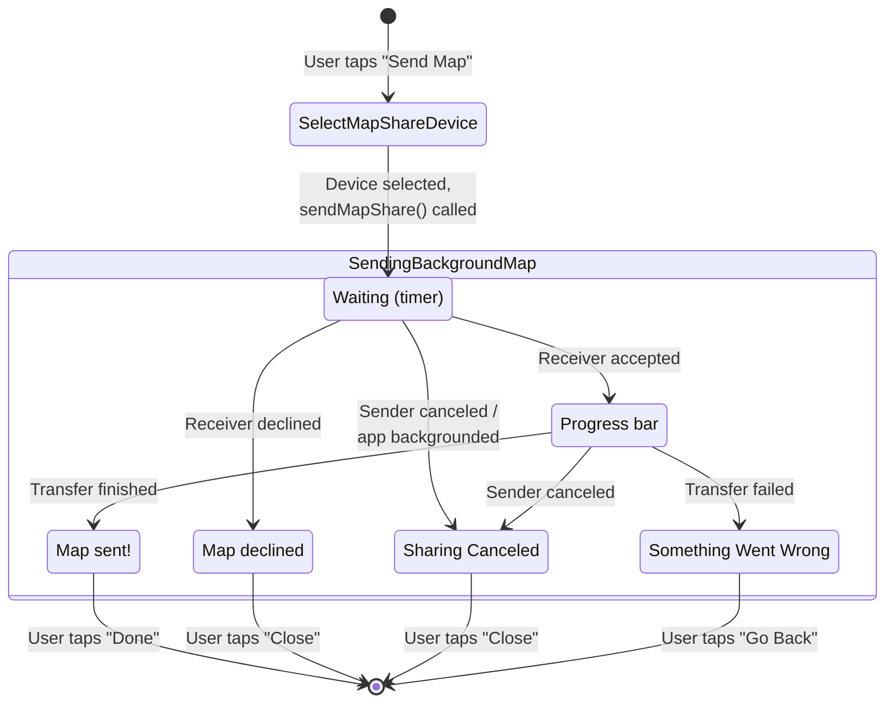
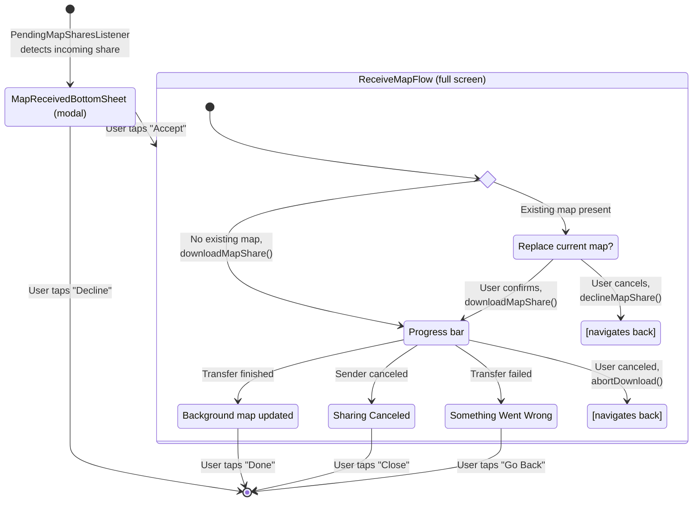

# Map Share State Machines

## Sender

```mermaid
stateDiagram-v2
    [*] --> SelectDevice: User taps "Send Map"
    SelectDevice --> Pending: Device selected,<br>sendMapShare() called
    Pending --> Downloading: Receiver accepted
    Pending --> Declined: Receiver declined
    Pending --> Aborted: Sender canceled /<br>app backgrounded
    Downloading --> Completed: Transfer finished
    Downloading --> Aborted: Sender canceled
    Downloading --> Error: Transfer failed
    Completed --> [*]: User taps "Done"
    Declined --> [*]: User taps "Close"
    Aborted --> [*]: User taps "Close"
    Error --> [*]: User taps "Go Back"

    state "SelectMapShareDevice" as SelectDevice
    state "SendingBackgroundMap" as SBM {
        state "Waiting (timer)" as Pending
        state "Progress bar" as Downloading
        state "Map sent!" as Completed
        state "Map declined" as Declined
        state "Sharing Canceled" as Aborted
        state "Something Went Wrong" as Error
    }
```

## Receiver

```mermaid
stateDiagram-v2
    [*] --> Pending: PendingMapSharesListener<br>detects incoming share

    state "MapReceivedBottomSheet (modal)" as Pending
    state "ReceiveMapFlow (full screen)" as RMF {
        state hasExistingMap <<choice>>
        [*] --> hasExistingMap
        hasExistingMap --> ConfirmReplace: Existing map present
        hasExistingMap --> Downloading: No existing map,<br>downloadMapShare()
        ConfirmReplace --> Downloading: User confirms,<br>downloadMapShare()
        ConfirmReplace --> DeclinedBack: User cancels,<br>declineMapShare()
        Downloading --> Completed: Transfer finished
        Downloading --> Canceled: Sender canceled
        Downloading --> Error: Transfer failed
        Downloading --> AbortedBack: User canceled,<br>abortDownload()

        state "Replace current map?" as ConfirmReplace
        state "Progress bar" as Downloading
        state "Background map updated" as Completed
        state "Sharing Canceled" as Canceled
        state "Something Went Wrong" as Error
        state "[navigates back]" as DeclinedBack
        state "[navigates back]" as AbortedBack
    }

    Pending --> RMF: User taps "Accept"
    Pending --> [*]: User taps "Decline"

    Completed --> [*]: User taps "Done"
    Canceled --> [*]: User taps "Close"
    Error --> [*]: User taps "Go Back"
```
